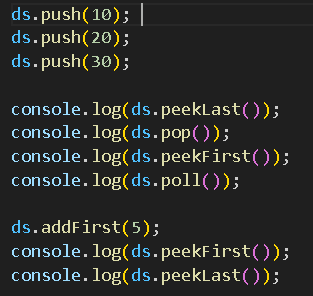
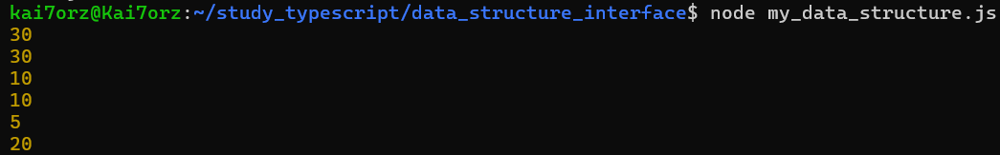

# データ構造インターフェースの実装

## 概要
データ構造に関するインターフェースの形成方法を学ぶ．
今回は，スタックおよびキューとして利用できるデータ構造デックの形成を具体的な例として実装する．そのために，スタック，キューのインターフェースを定義し，それらを拡張する形で，デックのインターフェースを定義する．加えて，独自のふるまいである，addFirstを持つようにする．

## 実際の動作

